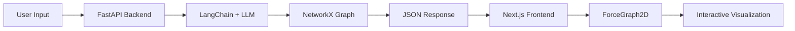

# 🎯 Domino-Agent: AI-Powered Financial Causal Inference Engine

<div align="center">


**Visualize the "Butterfly Effect" in Macroeconomics with AI**

[Demo](#-demo) • [Features](#-features) • [Quick Start](#-quick-start) • [Architecture](#-architecture) • [Contributing](#-contributing)

</div>

---

## 🌟 What is Domino-Agent?

Domino-Agent is an **AI-powered financial analysis system** that automatically discovers and visualizes causal chains in macroeconomic events. Using Large Language Models (LLMs) and graph theory, it helps analysts understand how a single event can trigger a cascade of impacts across global markets.

### Why Domino-Agent?

- 🧠 **AI-Driven Analysis**: Leverages GPT-4/DeepSeek to identify hidden causal relationships
- 📊 **Interactive Visualization**: Beautiful force-directed graphs with real-time animations
- 🔗 **Multi-Layer Impact Discovery**: Recursively explores direct and downstream effects
- 💼 **Professional Reports**: Auto-generates executive summaries in financial language
- ⚡ **Real-Time Processing**: Fast API backend with modern React frontend

---

## 🎬 Demo

> **Try it yourself**: Enter any macro event like "Fed raises interest rates by 50bps" and watch the causal chain unfold.


**Example Analysis**: "特朗普赢得大选" (Trump wins election)

- 🔴 **Root Event**: Political shift
- 🔵 **Direct Impacts**: US Dollar strength, Treasury yields, Defense stocks
- 🔵 **Downstream Effects**: Emerging market currencies, Renewable energy sector

---

## ✨ Features

### 🎯 Core Capabilities

| Feature                  | Description                                                                 |
| ------------------------ | --------------------------------------------------------------------------- |
| **Causal Discovery**     | Automatically identifies 3 direct impacts + 2 downstream effects per impact |
| **Sentiment Analysis**   | Classifies each relationship as positive/negative with explanations         |
| **Interactive Graph**    | Drag nodes, zoom, hover for details - fully interactive visualization       |
| **Narrative Generation** | AI-generated executive summary of the entire causal chain                   |
| **Bilingual Support**    | English and Chinese UI (easily extensible)                                  |

### 🎨 UI/UX Highlights

- **Glassmorphism Design**: Modern, premium light theme
- **Directional Arrows**: Clear cause → effect visualization
- **Animated Particles**: Orange particles flow along connections
- **Sidebar Controls**: Dedicated control panel for clean UX
- **Responsive Layout**: Works on desktop and tablet

---

## 🚀 Quick Start

### Prerequisites

- **Python 3.9+**
- **Node.js 18+**
- **OpenAI API Key** (or compatible endpoint like DeepSeek)

### 1️⃣ Backend Setup

```bash
cd backend

# Install dependencies
pip install -r requirements.txt

# Configure API Key
echo "OPENAI_API_KEY=your_key_here" > .env

# Start server
python -m uvicorn main:app --reload
```

The API will run on `http://localhost:8000`

### 2️⃣ Frontend Setup

```bash
cd frontend

# Install dependencies
npm install

# Start dev server
npm run dev
```

Open `http://localhost:3000` in your browser.

### 3️⃣ Usage

1. Enter a macro event in the sidebar (e.g., "Oil prices surge by 20%")
2. Click **"开始推演"** (Simulate)
3. Watch the causal graph build in real-time
4. Hover over connections to see explanations
5. Read the AI-generated report at the bottom

---

## 🏗️ Architecture



### Tech Stack

**Backend**

- FastAPI (API framework)
- LangChain (LLM orchestration)
- NetworkX (Graph construction)
- Pydantic (Data validation)

**Frontend**

- Next.js 14 (App Router)
- TypeScript
- TailwindCSS
- react-force-graph-2d
- Framer Motion

**AI**

- OpenAI GPT-4 / DeepSeek
- Structured output parsing
- Recursive impact analysis

---

## 📖 How It Works

### Step 1: Event Analysis

```python
# User inputs: "Fed raises rates"
direct_impacts = llm.analyze(event, count=3)
# Returns: [
#   {target: "Bond Prices", sentiment: "negative"},
#   {target: "USD Strength", sentiment: "positive"},
#   {target: "Tech Stocks", sentiment: "negative"}
# ]
```

### Step 2: Recursive Expansion

```python
for impact in direct_impacts:
    downstream = llm.analyze(f"Change in {impact.target}", count=2)
    graph.add_edge(event, impact.target)
    for sub_impact in downstream:
        graph.add_edge(impact.target, sub_impact.target)
```

### Step 3: Visualization

- Nodes colored by layer (Red = root, Blue = impacts)
- Arrows show directionality
- Particles animate along edges
- Tooltips display explanations

---

## 🎯 Use Cases

- **Risk Assessment**: Identify hidden risks in policy changes
- **Investment Strategy**: Discover sector rotation opportunities
- **Economic Research**: Visualize complex macro relationships
- **Education**: Teach economics through interactive simulations
- **Scenario Planning**: Explore "what-if" analyses

---

## 🤝 Contributing

We welcome contributions! Here's how you can help:

1. 🐛 **Report Bugs**: Open an issue with reproduction steps
2. 💡 **Suggest Features**: Share your ideas in Discussions
3. 🔧 **Submit PRs**: Fork, create a branch, and submit a pull request
4. 📚 **Improve Docs**: Help us make the documentation better

See [CONTRIBUTING.md](CONTRIBUTING.md) for detailed guidelines.

---

## 📄 License

This project is licensed under the **MIT License** - see the [LICENSE](LICENSE) file for details.

---

## 🌟 Star History

If you find this project useful, please consider giving it a ⭐ on GitHub!

---

## 🙏 Acknowledgments

- **LangChain** for LLM orchestration
- **react-force-graph** for graph visualization
- **FastAPI** for the amazing backend framework
- **Vercel** for Next.js and deployment tools

---

## 📬 Contact

- **Issues**: [GitHub Issues](https://github.com/yourusername/Domino-Agent/issues)
- **Discussions**: [GitHub Discussions](https://github.com/yourusername/Domino-Agent/discussions)
- **Twitter**: [@yourusername](https://twitter.com/yourusername)

---

<div align="center">

**Built with ❤️ by the Domino-Agent Team**

[⬆ Back to Top](#-domino-agent-ai-powered-financial-causal-inference-engine)

</div>
